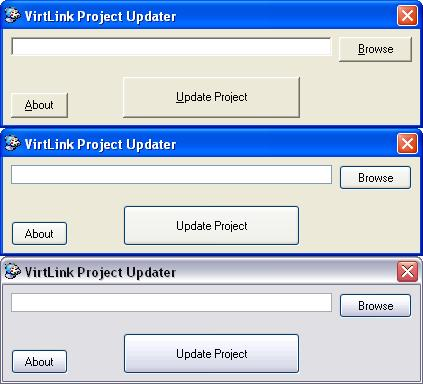



## Forces Windows XP to skin your app

### Description

This program forces Windows XP to skin your application with the Windows XP skin. Just select your project and click 'Update project'. Can't be easier! Tip: Copy the .manifest file into your Visual Basic 6 directory and rename it to 'vb6.exe.manifest'. Now Visual Basic is also skinned!
 
### More Info
 

             |
---                |---
**Submitted On**   |2002-04-08 18:47:36
**By**             |[VirtLink Software Productions](https://github.com/Planet-Source-Code/PSCIndex/blob/master/ByAuthor/virtlink-software-productions.md)
**Level**          |Advanced
**User Rating**    |4.8 (38 globes from 8 users)
**Compatibility**  |VB 4\.0 \(32\-bit\), VB 5\.0, VB 6\.0
**Category**       |[Graphics](https://github.com/Planet-Source-Code/PSCIndex/blob/master/ByCategory/graphics__1-46.md)
**World**          |[Visual Basic](https://github.com/Planet-Source-Code/PSCIndex/blob/master/ByWorld/visual-basic.md)
**Archive File**   |[Forces\_Win715694132002\.zip](https://github.com/Planet-Source-Code/virtlink-software-productions-forces-windows-xp-to-skin-your-app__1-33755/archive/master.zip)

